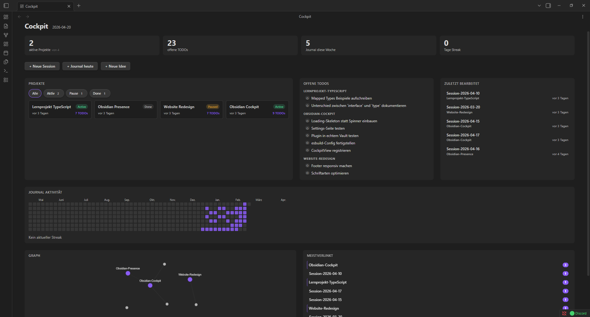

# Project Cockpit

An [Obsidian](https://obsidian.md) plugin that replaces the new tab with a project dashboard — all your active work at a glance.



## Features

- **Projects** — cards with status badges (Active / Paused / Done), TODO count, and last-modified time. Filter by status.
- **Open TODOs** — all unchecked `- [ ]` items across your projects, grouped by project. Click to check off inline or open the file.
- **Recent Sessions** — the last files you edited, with project and timestamp.
- **Journal Heatmap** — GitHub-style activity grid of the last 52 weeks. Reads your journal folder by filename (`YYYY-MM-DD.md`) or `datum` frontmatter.
- **Mini Graph** — force-directed graph of links between your project files. Drag, zoom, and pan. Double-click to reset.
- **Stats Bar** — active projects, open TODOs, journal entries this week, and current streak.
- **Backlinks Panel** — the 7 most linked files within your projects folder.
- **Quick Actions** — one click to create a new session, journal entry, or idea from a template.

## Installation

### From the Community Plugin Store

Search for **Project Cockpit** in *Settings → Community Plugins*.

### Manual

1. Download `main.js`, `styles.css`, and `manifest.json` from the [latest release](../../releases/latest).
2. Copy them into `<vault>/.obsidian/plugins/project-cockpit/`.
3. Enable the plugin in *Settings → Community Plugins*.

## Configuration

Open *Settings → Project Cockpit* to configure:

| Setting | Default | Description |
|---|---|---|
| Projects folder | `01_Projekte` | Root folder scanned for project subfolders |
| Journal folder | `04_Journal` | Folder containing your daily notes |
| Template — New Session | `05_Templates/Projekt-Session.md` | Template used by the *New Session* quick action |
| Template — Journal | `05_Templates/Journal.md` | Template used by the *Journal heute* quick action |
| Template — New Idea | `05_Templates/Idee.md` | Template used by the *Neue Idee* quick action |

### Project structure expected

Each project is a **subfolder** inside your projects folder. The plugin identifies the hub file by name — a `.md` file with the same name as its folder, placed as a sibling:

```
01_Projekte/
  My-Project/             ← session and note files go here
    Session-2026-04-17.md
    notes.md
  My-Project.md           ← hub file (same name as folder, frontmatter: status: active)
```

Supported status values: `active` / `aktiv`, `paused` / `pause`, `done` / `abgeschlossen`.

## Development

```bash
pnpm install
pnpm dev        # watch mode
pnpm build      # production build
pnpm lint       # ESLint
pnpm typecheck  # TypeScript
```

The plugin folder is symlinked into a local Obsidian vault for live testing.

## License

MIT
